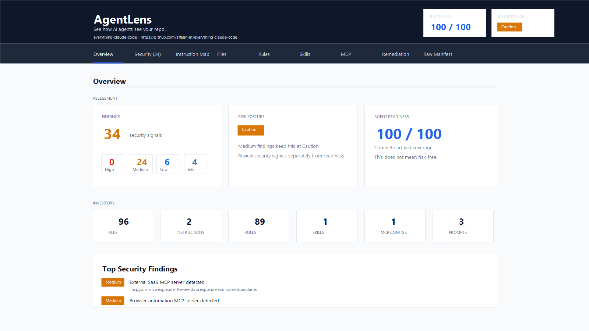
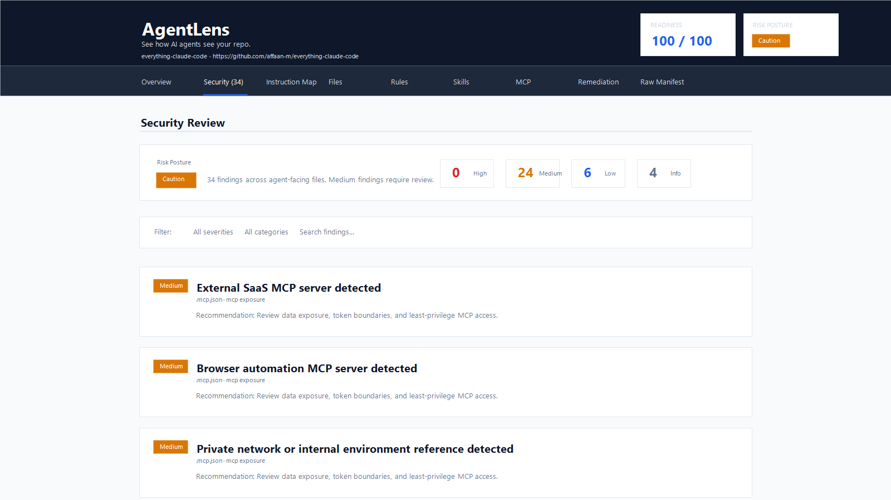

# AgentLens

**See how AI agents see your repo.**

AgentLens is a local-first CLI that scans your repository's agent instruction layer and generates an interactive, self-contained HTML report.

It discovers, parses, visualizes, and reviews files such as AGENTS.md, CLAUDE.md, GEMINI.md, AI coding rules, skill folders, command files, prompt files, and MCP configs.

No backend. No account. No source upload. The report works offline as a portable HTML artifact.

---

## Demo: everything-claude-code

For the best first impression, use a repo with multiple agent artifacts. Minimal repos may only produce a small report, while richer Claude Code repos better demonstrate AgentLens' ability to map instructions, rules, skills, MCP configs, prompts, security findings, and remediation guidance.

```bash
agentlens build https://github.com/affaan-m/everything-claude-code --out ./agentlens-report-claude-code
open ./agentlens-report-claude-code/report.html
```

```
AgentLens build complete.

Repo: everything-claude-code
Agent Readiness Score: 100 / 100
Security Posture: caution

Found:
  - Generic Instructions: 2
  - Rules: 89
  - Skills: 1
  - MCP Configs: 1
  - Prompts / Commands: 3

Security Review:
  - High: 0
  - Medium: 24
  - Low: 6
  - Info: 4

Report:
  ./agentlens-report-claude-code/report.html
```

The generated report includes the following sections:

<table>
<tr>
<td width="50%"><b>Overview</b></td>
<td width="50%"><b>Security Review</b></td>
</tr>
<tr>
<td>Agent Readiness Score with breakdown, Security Risk Posture with finding counts, and artifact inventory across instructions, rules, skills, MCP configs, and prompts.</td>
<td>Filterable findings by severity and category. Each finding includes evidence, file path, recommendation, and a one-click copy button for remediation prompts.</td>
</tr>
<tr>
<td width="50%"><b>Instruction Map</b></td>
<td width="50%"><b>MCP Exposure</b></td>
</tr>
<tr>
<td>Visual grouped map of all discovered agent instruction files. Click any item to jump to its full detail. Warning indicators highlight files with security findings.</td>
<td>MCP server configs with inline exposure findings. Shows registered servers, detected SaaS integrations, and permission scope analysis.</td>
</tr>
<tr>
<td width="50%"><b>Rules</b></td>
<td width="50%"><b>Skills</b></td>
</tr>
<tr>
<td>MDC rule files with glob patterns, description, and alwaysApply settings. Rendered markdown content with raw view toggle.</td>
<td>Skill folders with SKILL.md definitions, related files, and rendered content. Includes risk indicators for skills with security findings.</td>
</tr>
<tr>
<td width="50%"><b>Remediation Prompts</b></td>
<td width="50%"><b>Raw Manifest</b></td>
</tr>
<tr>
<td>Copyable prompts for each security finding. Paste directly into your AI coding agent to remediate issues. Prompts are deterministic and category-based.</td>
<td>Machine-readable manifest JSON embedded in the report. Same data written to manifest.json for CI integration and automation.</td>
</tr>
</table>

---

## Example Report

AgentLens generates a local interactive HTML report with readiness scoring, risk posture, artifact inventory, findings, and remediation guidance.





---

## Why HTML?

Agent instruction files are not meant to be reviewed linearly.

Markdown is good for writing instructions.
HTML is better for exploring, filtering, auditing, and acting on them.

AgentLens generates an interactive HTML artifact with:

- Separate Agent Readiness and Security Risk assessment
- Filterable security findings with remediation prompts
- Instruction Map for visual artifact discovery
- MCP exposure summary
- Searchable file details with rendered content
- Collapsible raw content views
- Copyable remediation prompts
- Embedded machine-readable manifest data

The report remains local-first and portable:

- no backend
- no account
- no external JavaScript
- no external CSS
- no source upload

---

## What AgentLens Reviews

AgentLens reviews the agent instruction layer of a repository.

| Category | What It Looks For |
|----------|-------------------|
| **Instructions** | AGENTS.md, CLAUDE.md, GEMINI.md, copilot-instructions.md |
| **Rules** | .cursor/rules/*.mdc, .cursorrules, rules/**/*.md |
| **Skills & Commands** | .claude/skills/*/SKILL.md, .claude/commands/*.md |
| **MCP Configs** | .mcp.json, mcp.json, .cursor/mcp.json |
| **Prompts** | prompts/*.md, prompts/**/*.md |
| **Security Signals** | Secrets, dangerous commands, weak boundaries, override language, data exfiltration, private environment details |
| **MCP Exposure** | Broad filesystem access, external SaaS tools, shell/terminal servers |

AgentLens does not perform general application SAST. It does not scan your app code for vulnerabilities. It focuses on the instructions and tool configs that AI coding agents may follow.

---

## Security Review

AgentLens includes a deterministic, local security review for agent instruction files.

It can flag:

| Finding Type | Example |
|-------------|---------|
| Possible secrets | API keys, tokens, credentials in instruction files |
| Dangerous commands | `rm -rf`, `curl \| bash`, `chmod 777` in agent instructions |
| Weak boundaries | "read all files", "run any command", "delete anything" |
| Instruction overrides | Language that bypasses safety policies or higher-priority instructions |
| Data exfiltration | Instructions to upload, send, or post repo content externally |
| Private environment | Internal URLs, network addresses, environment identifiers |
| MCP filesystem exposure | Broad filesystem access via MCP servers |
| External MCP tools | SaaS and cloud MCP servers with API token access |
| Missing security guidance | No security boundary section in AGENTS.md |

> "Your code may be secure, but your agent instructions may not be."

The scanner is:

- **local-only** — no repo content is uploaded
- **deterministic and rule-based** — no LLM or semantic analysis
- **human-reviewed** — findings should be reviewed and triaged by a human

---

## Usage

> AgentLens is not yet published to npm. For now, install it by cloning and building this repository locally (see below). Do not use `npx agentlens` until the package has been published.

### Local Development: Install AgentLens

Clone and build AgentLens itself locally:

```bash
git clone https://github.com/yunkewang/agentlens
cd agentlens
npm install
npm run build
npm install -g .
```

This installs the `agentlens` command globally on your machine.

### Running AgentLens Against a Target Repo

You do **not** need to manually clone the target repository. AgentLens accepts a public GitHub URL directly, clones the target repo internally into a temporary directory, scans it, and writes a self-contained HTML report to the `--out` directory.

**Scan a public GitHub repo (recommended):**

```bash
agentlens build https://github.com/affaan-m/everything-claude-code --out ./agentlens-report-claude-code
open ./agentlens-report-claude-code/report.html
```

This writes the interactive HTML report to `./agentlens-report-claude-code/report.html`.

**Scan a local repo:**

```bash
agentlens build ./my-repo --out ./agentlens-report
open ./agentlens-report/report.html
```

### Future npm Usage

Once AgentLens is published to npm, no local clone or build will be required:

```bash
# Install globally
npm install -g agentlens

# Or run without installing
npx agentlens build https://github.com/affaan-m/everything-claude-code --out ./agentlens-report-claude-code
```

### Commands

```bash
# Build a report for a public GitHub repo
agentlens build https://github.com/affaan-m/everything-claude-code --out ./agentlens-report-claude-code
open ./agentlens-report-claude-code/report.html

# Build a report for a local repo
agentlens build ./my-repo --out ./agentlens-report
open ./agentlens-report/report.html

# Scan only and write manifest.json
agentlens scan ./my-repo --out ./agentlens-scan

# Build and serve the report through a local web server
agentlens serve https://github.com/affaan-m/everything-claude-code --out ./agentlens-report-claude-code --port 4321
```

**`build`** generates `report.html` and `manifest.json` in the output folder.
**`serve`** builds the report and opens it through a local web server.
**`--port`** belongs to `serve`, not `build`.

Remote GitHub URL scanning supports public repos only. Private repos can be scanned by cloning locally first.

### Options

| Flag | Description |
|------|-------------|
| `-o, --out <path>` | Output directory |
| `-p, --port <number>` | Port for `serve` command (default: 4321) |
| `-v, --verbose` | Verbose output |
| `--include-docs` | Also include README and Markdown project documentation in the report |
| `--max-docs <number>` | Max project docs to include (default: 100). Requires `--include-docs`. |
| `--max-file-size <bytes>` | Skip project doc files larger than this many bytes (default: 1048576). Requires `--include-docs`. |

### Include Project Docs

By default, AgentLens focuses on the agent instruction layer. To also include README and Markdown documentation, use:

```bash
agentlens build https://github.com/affaan-m/everything-claude-code --out ./agentlens-report-claude-code --include-docs
open ./agentlens-report-claude-code/report.html
```

This is useful when you want the report to explain how the project works, not just its agent rules and skills.

When `--include-docs` is enabled, AgentLens also discovers `README.md`, `README.*.md`, and Markdown / MDX files under `docs/`, `guides/`, `examples/`, `.ai/`, `.github/`, and the rest of the repository (excluding `node_modules`, `.git`, `dist`, `build`, `coverage`, `vendor`, `.next`, `out`, `target`, `tmp`, and `temp`). Discovered files are listed in a new **Project Docs** tab and included in `manifest.json` as entries with `"type": "project_doc"`.

> **Note:** Large repositories may contain many Markdown files. AgentLens limits project docs by default and skips generated/build folders. Raise the limits with `--max-docs` and `--max-file-size` if you need to capture more.

The Instruction Map and the Agent Readiness Score remain focused on agent instruction files. Project docs are also passed through the security scanner — findings from project documentation are tagged with `source: "project_doc"` so reviewers can tell them apart from findings on agent instruction files. The "missing security guidance" check still only looks at agent instruction files.

### Troubleshooting

If `agentlens` is not found after `npm install -g .`, you can either re-run the install from the AgentLens repo root, or invoke the CLI directly from the build output:

```bash
node dist/cli.js build https://github.com/affaan-m/everything-claude-code --out ./agentlens-report-claude-code
open ./agentlens-report-claude-code/report.html
```

---

## Output

AgentLens writes:

```
<output-folder>/
  manifest.json
  report.html
```

- `report.html` is the interactive, self-contained HTML report.
- `manifest.json` is the machine-readable scan output.
- `report.html` can be opened locally, shared as a file, or uploaded as a CI artifact.

---

## Agent Readiness vs. Security Risk

AgentLens separates two independent assessments:

### Agent Readiness Score (0–100)

Measures whether agent artifacts are present and complete. A high score means the repo has the right files in place — it does **not** mean the repo is safe.

| Factor | Points |
|--------|--------|
| AGENTS.md found | +20 |
| Project-wide instruction file (CLAUDE.md, etc.) | +15 |
| Rule files found | +15 |
| Skill or command files found | +15 |
| MCP config found and parseable | +10 |
| Test/validation guidance in instructions | +10 |
| Security guidance in instructions | +10 |
| Style/convention guidance | +5 |

Maximum: 100 points.

### Security Risk Posture

Measures risk signals in the agent instruction layer. A repo can score 100/100 on readiness while still having a "Caution" or "Needs Review" risk posture.

| Posture | Meaning |
|---------|---------|
| **Clean** | No security findings detected |
| **Caution** | Medium-severity findings present — review recommended |
| **Needs Review** | High-severity findings present — action required |

For example, [everything-claude-code](https://github.com/affaan-m/everything-claude-code) scores 100/100 on readiness (all artifact types present) but shows a "Caution" risk posture with 24 medium-severity findings related to MCP exposure and instruction patterns.

---

## Local-First Privacy Model

AgentLens is designed for private and enterprise repositories.

- It reads files locally.
- It does not upload source code.
- It does not require an API key.
- It does not require a hosted backend.
- It does not use external JavaScript in generated reports.
- It can scan private repos after they are cloned locally.

> **Note:** Generated reports may contain sensitive repository instruction content, internal paths, internal URLs, MCP configuration details, or security findings. Review the report before sharing it externally.

---

## MVP Limitations

- Remote GitHub URL scanning supports public repos only. Private repos can be scanned after cloning locally.
- Security review is deterministic and rule-based; no LLM or semantic analysis yet.
- No continuous monitoring or scheduled scans.
- No PR comments yet; GitHub Actions support is planned.
- No PDF export; HTML report is the primary shareable output.
- No plugin system yet.

---

## Roadmap

- GitHub Actions integration for CI-based agent instruction review
- More agent instruction formats, including `.windsurfrules`, additional Copilot/Gemini/Codex patterns, and custom prompt files
- Diff mode to compare agent instruction changes across branches, commits, or PRs
- Configurable security rules and allowlists
- Optional authenticated remote GitHub scanning
- VS Code extension
- Optional hosted/team workflows for organizations

---

## Design Principles

- Local-first
- Vendor-neutral
- HTML-native reports
- Deterministic security checks
- Portable static output
- Human-readable and machine-readable output
- Useful before adding any AI recommendations

---

## Positioning

AgentLens is not tied to any single AI coding product.

It supports common instruction formats used across AI coding workflows, but the goal is broader:

**Map, inspect, and secure the instruction layer of AI-native repositories.**

---

## License

MIT
